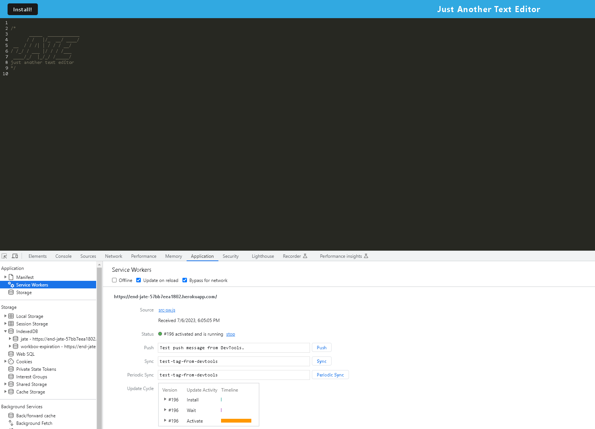

# Text Editor

## Description

This app is a text editor that includes a service worker and IndexedDB is used for data storage.

The editor can be modified and will retain the data in subsequent visits.

Application Site and Preview Image:

[Website](https://end-jate-57bb7eea1802.herokuapp.com/)

## Usage

Upon loading site the logo is visible. Notes and text can be entered and will be stored via IndexedDB that can be accessed on the Application tab.

Also within the Application tab the service worker can be viewed, unregistered, etc.

## Contributors

1. Weng Fei Fung - helped incorporate service worker code.

## Questions

If you have any questions you can reach me at edrezner7@gmail.com. Visit my GitHub [edrezner](https://www.github.com/edrezner) to see more of my work.
